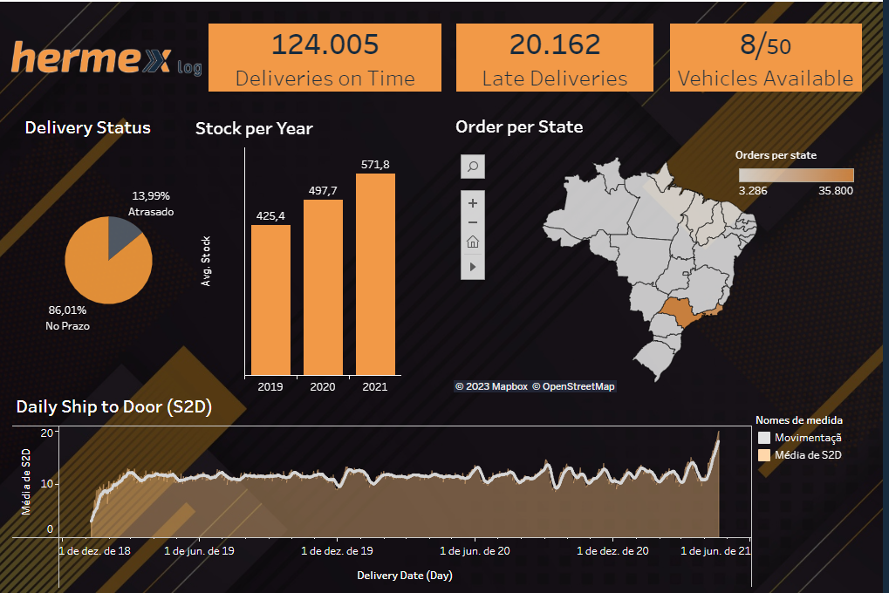

# Hermex log - Data Analysis - BI

> Alura's 3rd BI Challenge 

## Problem description

The company Hermex needs to analyze data on the logistics of its business deliveries.

Data contents were made available in the database regarding delivery information, as well as the company's visual identity.

The results can be accessed at: [Tableau Dashboard](https://public.tableau.com/app/profile/marcos.assis6468/viz/ChallengeBISem2/Hermexlog-Dashboard?publish=yes)

## Tools

- Python - Data cleaning.
- Tableau - Data analysis.

## Objectives

Create one or more dashboards that measure:

* Deliveries made on time.
* Late deliveries
* Number of vehicles available.
* Ship to Door (S2D) in days.
* Deliveries by state.
* Average Inventory level per year.

## Dashboards

3 dashboards were implemented, related to:

1. General view.
2. Products
3. Orders in Transit.

### General view:

In this dashboard, all the information required in the project objectives (highlighted above) are evaluated.

In this view, the "Delivery Status" field can be used as a filter. Thus, it is possible to identify that the average S2D is 10 days for on-time deliveries and 20 days for late deliveries.

In addition, it can be seen that the average quantity of products in stock has grown year after year.

Finally, the map of Brazil illustrates the number of orders by state. It can be seen that the states of São Paulo and Rio de Janeiro concentrate the largest number of orders for the company. In addition, this map also works as a filter, allowing on-time deliveries, late deliveries and average S2D to be evaluated by State.

### Produtos

This dashboard brings additional information related to products.

147,924 uncategorized products were identified, as well as 10 different categories not present in the company's database. It may represent an outdated database, or order records with wrong reference to products.

In addition, this view highlights the TOP selling product categories, and the most profitable product categories.

Finally, on the map of Brazil it is possible to identify the most popular product category by State, as well as the number of orders of them.

### Orders in Transit

This dashboard brings additional information regarding orders in transit.

3,757 products were identified in transit. Furthermore, even though there are 3 types of vehicles available for deliveries to the company (Truck, Car and Motorcycle), 100% of orders in transit are attributed to motorcycles.

The map of Brazil works as a filter, and highlights the number of orders in transit by State. Again, São Paulo and Rio de Janeiro are the states with the highest number of products in transit.

Finally, the bottom graph illustrates the number of expected deliveries per day in the evaluated months (March and May 2021). It can be seen that the number of deliveries in April is higher than in May in the country. By selecting a specific state on the map, it is possible to identify the expected deliveries per day for each state separately.
